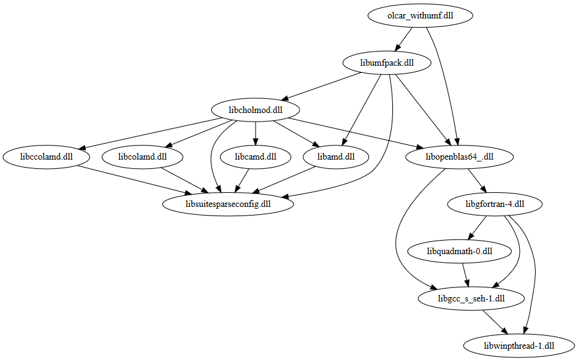

# olca-native



This project packages the native calculation libraries for
[openLCA](https://github.com/GreenDelta/olca-app) as Maven modules. It also
provides some utility functions for loading these libraries on different
platforms. Currently, these libraries come in two facets: BLAS/LAPACK only and
UMFPACK (which contains BLAS/LAPACK). With UMFPACK you can solve large sparse
systems very efficiently in openLCA. However, UMFPACK is distributed under
the GPL v2/3 which is not compatible with the openLCA application. This is why
the UMFPACK libraries are not included by default in openLCA but can be added by
the users.

# Usage

In order to use these calculation libraries you need to add the respective
version of your platform to the classpath, e.g. for Windows:

```xml
<dependency>
  <groupId>org.openlca</groupId>
  <artifactId>olca-native</artifactId>
  <version>{version}</version>
</dependency>
<dependency>
  <groupId>org.openlca</groupId>
  <artifactId>olca-native-umfpack-win-x64</artifactId>
  <version>{version}</version>
</dependency>
```

You can then load the libraries from you file system in the following way:

```java
File dir = ...;
NativeLib.loadFrom(dir);
```

This will try to load the libraries for your platform from the given folder.
If there are no libraries at this location yet, it will try to extract them
from the classpath. Thus, you can also just put the libraries into a folder
and load them from there. `NativeLib.loadFrom(<ROOT>)` will try to load the
libraries from the following sub-folder:

```
<ROOT>/olca-native/<VERSION>/<OS.ARCH>

e.g.

~/openLCA-data-1.4/olca-native/0.0.1/x64
```

In that folder, there is an `olca-native.json` file that contains the library
load-order and the modules (currently `blas` and `umfpack`) that are provided
by the package.

```json
{
  "modules": [
    "blas"
  ],
  "libraries": [
    "libwinpthread-1.dll",
    "libgcc_s_seh-1.dll",
    "libquadmath-0.dll",
    "libgfortran-5.dll",
    "libopenblas64_.dll",
    "olcar.dll"
  ]
}
```

## Building from source

In order to build the JNI bindings, you need to have a Rust toolchain (with
`ructc`, `cargo`, and a platform specific linker) installed. The respective
platform entry in the `config` file needs to point to a folder where the
OpenBLAS and UMFPACK libraries including all dependencies can be found (we use
the library folder of a [Julia](https://www.julialang.org) installation for
this; note that the current Julia 1.7 version fails with segfaults in some
calculations; the **1.6 version** seems to work). This project contains a
`build.bat` script for Windows and a `build.sh` script for Linux and macOS for
running the JNI build.

On **Windows**, the build script first [generates
lib-files](https://stackoverflow.com/a/16127548/599575) for each library we want
to link against. This is done automatically from the definition files in the
`windefs` folder but it requires that the `lib` tool from the MSVC 2017 build
tools (which are anyhow required for the Rust compiler) is in your `PATH` (e.g.
something like this: `C:\Program Files (x86)\Microsoft Visual
Studio\2019\BuildTools\VC\Tools\MSVC\14.24.28314\bin\Hostx64\x64`).

The build scripts should then generate the libraries (`olcar.{dll|so|dylib}`
with BLAS & LAPACK bindings and `olcar_withumf.{dll|so|dylib}` with additional
UMFPACK bindings in the `bin` folder.


## The `package.py` script

For managing the dependencies and generating distribution packages, this project
contains a `package.py` script that can be executed with Python 3.8+:

```bash
# Usage

# run the build if required and copy the libraries
# into respective platform package
python3 package.py

# print the dependency graph in dot-format; can
# be visualized with Graphviz
python3 package.py viz

# clean-up build resources
python3 package.py clean

```

To calculate the library dependencies, the `package.py` script uses the
following tools to collect the dependencies:

* Linux: `ldd`
* macOS: `otool`
* Windows: the command line version of the
  [Dependencies](https://github.com/lucasg/Dependencies) tool which needs to
  be available in the system path


## Running the tests

The `olca-native` module contains a small test suite for testing the libraries.
Set the library dependency to the respective package that you want to test
in the project's `pom.xml` to run the tests. Also, delete the
`~/openLCA-data-1.4/olca-native` folder before running the tests, because this
is used as the library load-location.
